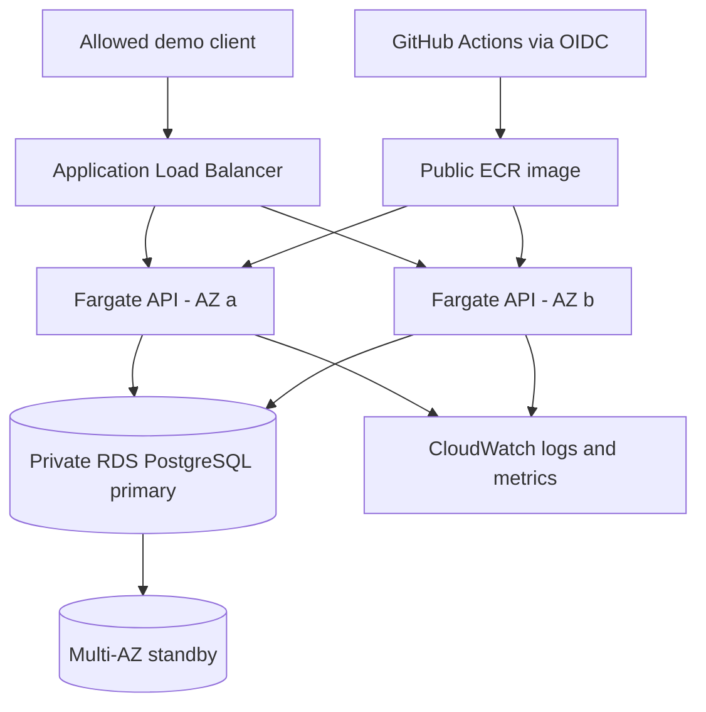

# CloudLift

Containerized application migration and reliability testing on AWS.

CloudLift takes a Node.js/Express and PostgreSQL application from local Docker Compose to AWS ECS Fargate, an Application Load Balancer, and encrypted Multi-AZ RDS. Terraform defines the infrastructure; GitHub Actions builds and deploys the container using OIDC authentication.

**Status:** Deployed and tested in `us-east-1` on September 18, 2026, then torn down to control costs. There is no live demo endpoint. The source, test results, and deployment history remain available.

## Architecture



Fargate tasks use public subnets and public IPs for outbound registry/AWS API access; their inbound application traffic is allowed only from the load balancer. The database is in private subnets. The demo avoids a NAT gateway.

## Verified results

| Check | Observed result |
| --- | --- |
| API integration | 9 checks passed before and after GitHub deployment |
| Multi-AZ application | Two healthy targets in `us-east-1a` and `us-east-1b` |
| Two-task load sample | 100/100 successful; p50 57.82 ms, p95 125.35 ms |
| One-task load sample | 100/100 successful; p50 57.19 ms, p95 63.95 ms |
| Controlled task stop | Automatic replacement; 281 probes, zero failures; both targets confirmed healthy within 82 seconds |
| RDS forced failover | Primary moved from AZ a to AZ b; 277 probes, five failures; original synthetic customer retained |
| GitHub deployment | OIDC authentication, image publication, and ECS deployment succeeded |
| Teardown | Empty Terraform state; AWS checks found no CloudLift database, load balancer, or ECS cluster |

These are small, client-observed demo tests, not capacity benchmarks or availability guarantees. The one-task sample was faster; the experiment does not demonstrate a speedup from two tasks. Scaling was manual, not autoscaling. Database failover caused a temporary interruption.

See the [verification record](docs/evidence.md), [raw evidence](docs/evidence/), and [successful deployment run](https://github.com/rishdhingra/cloudlift/actions/runs/35393411374).

## Run locally

Prerequisites: Docker with Compose and Python 3.

```sh
docker compose up --build -d
python3 scripts/test_api.py http://localhost:3000
python3 scripts/load_test.py http://localhost:3000 --requests 100 --workers 5
docker compose down
```

The API listens on `http://localhost:3000`. Compose keeps its database volume when stopped normally.

| Endpoint | Purpose |
| --- | --- |
| `GET /` | Service information |
| `GET /health` | Application/database health |
| `GET /api/customers` | List up to 100 customers |
| `POST /api/customers` | Create a synthetic customer from `name` and `email` |
| `GET /api/stats` | Customer count |

## Security and scope

- Non-root containers; read-only container root filesystem in ECS.
- IAM database authentication for the application, with certificate-verified database TLS.
- Secrets Manager supplies the administrator credential only to the one-off migration task.
- Encrypted database storage and security-group boundaries between the load balancer, app, and database.
- GitHub deployment access restricted to this repository's `main` branch using its immutable OIDC identity.

This is an educational demo using synthetic customer data. The client-facing endpoint uses HTTP with an IP allowlist and has no application authentication. It is not a production service or a demonstration of a real customer migration.

## CI and deployment

[Validation](.github/workflows/ci.yml) checks integration behavior, Terraform, and the Docker build. [Deploy existing demo](.github/workflows/deploy.yml) is manually triggered and updates an already provisioned service. It does not create the infrastructure.

Follow the [AWS demo runbook](docs/demo-runbook.md) for a future session. AWS resources incur usage charges. Generate fresh local inputs and review the plan before deploying; the previous demo's deadline and IP settings are stale.

Public ECR images remain separate from Terraform teardown. Final billed cost and residual backup/secret checks are not established by the primary-resource cleanup check.
