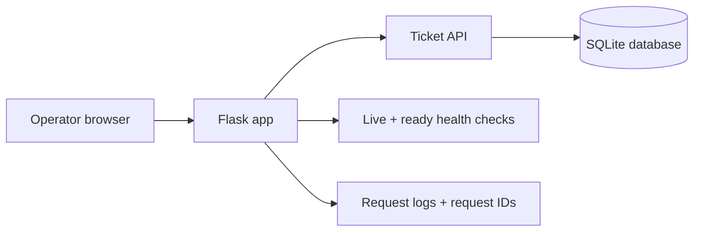
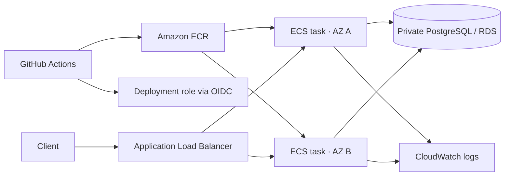

# CloudLift

CloudLift is a small service-ticket app that I built as a hands-on reliability and cloud migration lab. The starting point is intentionally simple: one Flask application, one SQLite database, and a container definition. From there, the project documents the steps I would take to move the app toward a more resilient AWS deployment.

The point of the project is not just to have a ticket form. It is to practice the engineering details that make a service easier to operate: durable storage, health checks, authenticated writes, useful request logs, tests, and a clear migration plan.

## What it does

- Creates and lists service tickets
- Moves tickets between `open` and `resolved`
- Persists tickets in SQLite so they survive an app restart
- Separates liveness from readiness checks
- Protects write operations with a bearer token
- Adds request IDs and basic security headers to responses
- Rejects invalid or oversized input
- Runs locally with Gunicorn or Docker Compose

## How the current version works



This is the working local baseline. It is not currently deployed to AWS, and the repository does not provision cloud resources by itself.

## Try it locally

You will need Python 3.12 or newer.

```sh
python3 -m venv .venv
. .venv/bin/activate
pip install -r requirements.txt -r requirements-dev.txt
export CLOUDLIFT_WRITE_TOKEN="$(python -c 'import secrets; print(secrets.token_urlsafe(32))')"
gunicorn --bind 127.0.0.1:8000 --workers 2 'app:create_app()'
```

Open <http://localhost:8000> and create a few synthetic tickets. Restarting the server should leave the tickets in place. The operator token is held in the UI only and should never be committed or shared.

If Docker is installed, the same baseline can be started with:

```sh
export CLOUDLIFT_WRITE_TOKEN="choose-a-local-token"
docker compose up --build
```

The database is stored in a named Docker volume. `docker compose down` stops the app; `docker compose down --volumes` also removes the stored data.

## API and health checks

| Method | Route | Purpose |
| --- | --- | --- |
| `GET` | `/api/tickets` | List up to 100 tickets |
| `POST` | `/api/tickets` | Create a ticket (write token required) |
| `PATCH` | `/api/tickets/<id>` | Change a ticket's status (write token required) |
| `GET` | `/health/live` | Check whether the process is responding |
| `GET` | `/health/ready` | Check whether SQLite is available |

Write requests use this header:

```text
Authorization: Bearer <CLOUDLIFT_WRITE_TOKEN>
```

## Verify the project

```sh
python -m pytest -q
curl --fail http://localhost:8000/health/live
curl --fail http://localhost:8000/health/ready
```

The tests cover the ticket lifecycle, persistence across app instances, authorization, invalid input, SQL-injection-style input, request size limits, and the difference between liveness and readiness when the database is unavailable.

## The migration I am working toward

The next version would replace the single local process and SQLite file with a containerized AWS service:



That diagram is a target architecture, not a claim that this infrastructure is already deployed. Before scaling out, the app needs a PostgreSQL adapter, schema migrations, shared-storage tests, HTTPS, scoped IAM, and deployment/rollback checks. The project uses synthetic data and does not implement accounts, tenant isolation, or production-grade authorization.

## What I learned

This project helped me connect application code with the operational questions that come after it: What does “healthy” mean? What happens when storage fails? How do I know which request produced an error? How can I make a migration measurable instead of just drawing a cloud diagram?

The detailed milestones and constraints are in [`docs/build-plan.md`](docs/build-plan.md).
