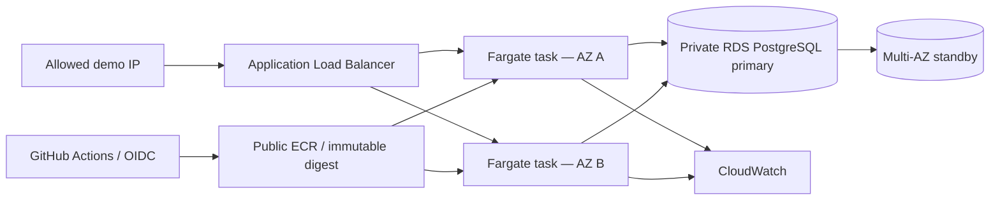

# CloudLift — AWS migration and reliability lab

A reproducible migration of a Dockerized Node.js/PostgreSQL API to ECS Fargate, an Application Load Balancer, and encrypted Multi-AZ RDS. Designed as a **temporary résumé demonstration**, with bounded tests and explicit teardown.

**Status:** local integration/load/outage tests passed; Terraform validated and its preliminary plan reviewed. The AWS application deployment, GitHub deployment run, and AWS failover evidence are **pending**. Existing VPC networking and the earlier ECR image are already in AWS. Do not describe the full cloud deployment as completed yet.

## Architecture



The API has customer creation/listing, customer counts, and a database-aware `/health` endpoint. All demo records are synthetic.

## Security and cost decisions

- Private database subnets, encrypted RDS storage, and certificate-verified database TLS.
- Runtime database access uses IAM tokens and a PostgreSQL role restricted to SELECT/INSERT; only the one-off migration task receives the RDS-managed master secret.
- GitHub OIDC trust is restricted to this repository's `main` branch. No AWS keys are stored in GitHub.
- Two API tasks, no autoscaling, 20 GiB database storage without storage autoscaling, no NAT gateway, three-day log retention.
- API tasks use public subnets/public IPs for outbound image downloads; inbound traffic is accepted only from the ALB security group. This is a cost tradeoff, not private application subnet isolation.
- ALB access is restricted to one explicitly supplied client IP. The demo uses HTTP and fake data. Internet TLS/custom domain and end-user authentication are not implemented; this is not a production customer service.
- Scheduled AWS-side emergency cleanup scales the API to zero and deletes RDS and ALB. Full Terraform teardown is still required to remove residual resources. Schedules are a fallback, not a billing cap; they must be verified after deployment.
- The small instance and short tests demonstrate mechanisms, not production capacity or an uptime SLA. RDS IAM authentication uses additional memory, so the demo selects `db.t4g.small` rather than a micro instance.

## Run locally

```sh
docker compose up --build -d
python3 scripts/test_api.py http://localhost:3000
python3 scripts/load_test.py http://localhost:3000 --requests 100 --workers 5
docker compose down
```

The normal local PostgreSQL volume persists. Do not delete it if you need its data. The separate `compose.test.yml` uses disposable test containers on port 13000.

## AWS deployment and evidence

Follow [the demo runbook](docs/demo-runbook.md), including permission and credit checks before creating services. Use [the evidence checklist](docs/evidence.md) to keep actual results separate from planned work.

GitHub `Validate CloudLift` checks the API, Terraform, and container build. `Deploy existing demo` is manually triggered and updates an already-running ECS service; it cannot provision infrastructure. Configure its repository variables after Terraform deployment.

## Résumé wording

After successful cloud verification, a defensible description is: “Deployed a Dockerized Node.js/PostgreSQL API using Terraform, ECS Fargate, ALB, and Multi-AZ RDS; automated container updates with GitHub Actions/OIDC and documented bounded load and recovery tests using CloudWatch.”

Only claim measured results after the evidence checklist is complete. Keep the repository and recordings after deleting the live infrastructure.
