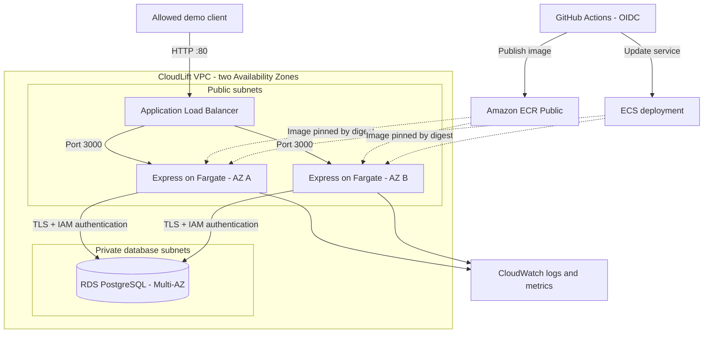

# CloudLift

CloudLift is a cloud migration and reliability project built around a small customer API. I started with Node.js, Express, and PostgreSQL in Docker Compose, then deployed the API to AWS using Terraform, ECS Fargate, an Application Load Balancer, and Multi-AZ RDS PostgreSQL.

I kept the application simple so I could focus on the infrastructure: getting containers into AWS, connecting to a private database, deploying through GitHub Actions, and checking what happens when a container or the database fails.

**Status:** The AWS demo was deployed and tested on September 18, 2026, then torn down. The demo endpoint is no longer live. The code, Terraform configuration, and [verification record](docs/evidence.md) are saved here.

## What I built

- An Express API that creates and lists customers and returns a customer count.
- A local PostgreSQL database with a named Docker volume for persistence.
- Terraform for a VPC across two Availability Zones, an ALB, ECS Fargate, private Multi-AZ RDS, IAM roles, and CloudWatch monitoring.
- IAM database authentication and verified TLS connections for the AWS API tasks. A separate migration task uses the RDS-managed admin secret to initialize the database and application role.
- GitHub Actions for integration checks, Terraform validation, container builds, and a manually triggered deployment to an existing demo environment through OIDC.
- Integration and bounded load tests, plus recorded container-replacement and database-failover checks.

## Architecture

This is the architecture used in the completed AWS demo:



The Fargate tasks use public subnets and public IPs for outbound access without a NAT gateway. Their security group accepts application traffic only from the ALB. RDS is not publicly accessible and accepts PostgreSQL connections only from the task security group. ALB ingress is restricted to explicitly allowed client addresses.

## What I tested on AWS

The [verification record](docs/evidence.md) links to the saved results and explains how each check was performed.

| Check | Recorded result |
| --- | --- |
| API integration | Nine checks passed before and after the GitHub Actions deployment. |
| Bounded load | One-task and two-task samples each completed 100 requests with five workers and zero failures. |
| Container replacement | After stopping one task, ECS replaced it. Both ALB targets were observed healthy within 82 seconds; all 281 health probes passed and the original customer remained. |
| RDS forced failover | Primary and standby switched AZs and the original customer remained. Five probes failed, with a 40.81-second gap between successful responses. |
| Deployment | GitHub Actions published an image, updated the ECS task definition, and waited for service stability. Subsequent API checks passed. |
| Teardown | Terraform removed the stack. Saved AWS checks found no CloudLift RDS instance, ALB, or ECS cluster. |

These were small, controlled demo tests. The load samples do not establish a scaling improvement or production capacity. The failover response gap is an observation from sampled requests, not an exact downtime measurement or a zero-downtime result.

## Run locally

You need Docker with Compose. Python 3 is needed for the test scripts. Run these commands from the repository root:

```sh
git clone https://github.com/rishdhingra/cloudlift.git
cd cloudlift
docker compose up --build -d
```

The API runs at <http://localhost:3000>. It returns JSON; there is no browser dashboard. Compose starts PostgreSQL 16 and the Node.js 22 app, waits for the database health check, and creates the customer table on application startup. The Compose credentials are for local demo use, and it publishes ports 3000 and 5432 on the host.

Check the database connection and create a synthetic customer:

```sh
curl --fail http://localhost:3000/health

curl -i http://localhost:3000/api/customers \
  -H 'Content-Type: application/json' \
  -d '{"name":"Demo Customer","email":"demo@example.invalid"}'

curl --fail http://localhost:3000/api/customers
curl --fail http://localhost:3000/api/stats
```

Submitting the same email again returns `409`. Stop the containers with `docker compose down`; the named database volume keeps the data. Adding `--volumes` also deletes that data.

## API

| Method | Route | Behavior |
| --- | --- | --- |
| `GET` | `/` | Service name and running status |
| `GET` | `/health` | Runs a database query; returns `200` when connected and `503` on failure |
| `GET` | `/api/customers` | Lists up to 100 customers, ordered by ID |
| `POST` | `/api/customers` | Creates a customer; returns `201`, `400` for invalid input, or `409` for a duplicate email |
| `GET` | `/api/stats` | Returns `customer_count` |

The API validates names and email format, uses parameterized SQL, limits JSON bodies to 16 KB, and logs request method, path, status, and duration. It does not implement user accounts, bearer-token authentication, or customer update/delete endpoints. `/health` is a combined application/database check; there are no separate liveness and readiness routes.

## Verification and deployment

With the local containers running:

```sh
python3 scripts/test_api.py http://localhost:3000
python3 scripts/load_test.py http://localhost:3000 --requests 100 --workers 5
```

The integration script runs nine checks covering service identity, database connectivity, invalid input, customer creation, duplicate handling, listing, and count. It creates a synthetic customer on each run. The load script sends requests to `/health` and allows at most 300 requests and ten workers per run.

[CI](.github/workflows/ci.yml) runs on pushes and pull requests. It starts PostgreSQL, runs the API integration script, checks Terraform formatting and validity, and builds the Docker image.

[Deploy existing demo](.github/workflows/deploy.yml) is a separate, manually triggered workflow. It uses OIDC instead of stored AWS access keys, publishes to ECR Public, and deploys an image pinned by digest. It requires an active ECS service and at least 20 minutes remaining before the configured demo deadline. It does not provision the infrastructure or recreate the deleted demo.

To repeat the AWS deployment, follow the [demo runbook](docs/demo-runbook.md), including database initialization and teardown. It uses billable AWS resources and includes settings specific to this repository and account that need review before reuse.

## Design choices and limits

- **Temporary demo:** HTTP and restricted client access were used for synthetic data. HTTPS and application authentication are still needed before broader use.
- **Manual scaling:** The demo ran with one and two tasks. There is no automatic scaling policy.
- **Separate database privileges:** AWS API tasks use the `cloudlift_app` role with customer read/insert permissions; the migration task handles schema and role setup.
- **Cost control:** The demo was manually torn down after testing. Fallback cleanup schedules were created and inspected, but their timed execution was not tested. They do not replace full teardown; ECR images are outside the Terraform stack.

## Repository layout

```text
app/                  Express API, PostgreSQL connection, migration, Dockerfile
terraform/            AWS network, database, ECS, IAM, monitoring, cleanup schedules
scripts/              Integration/load tests and AWS demo preparation helpers
.github/workflows/    CI and manual deployment
docs/evidence.md      Results from the completed demo
docs/evidence/        Saved AWS checks, metrics, logs, and test results
docs/demo-runbook.md  Deployment, verification, and teardown instructions
docker-compose.yml   Local API and persistent PostgreSQL database
compose.test.yml     Disposable local test configuration
```

## What I learned

The most useful part was testing the system after deployment. Replacing a task kept the API available during the observed test, while database failover caused a visible interruption. Working through IAM permissions, database initialization, deployment checks, and teardown made the difference between an architecture diagram and a deployment I could explain with evidence.
